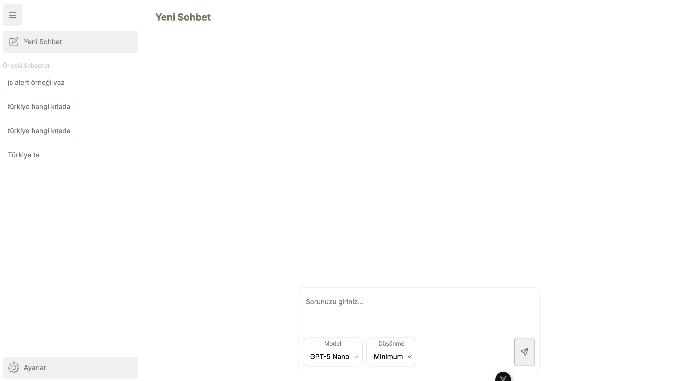
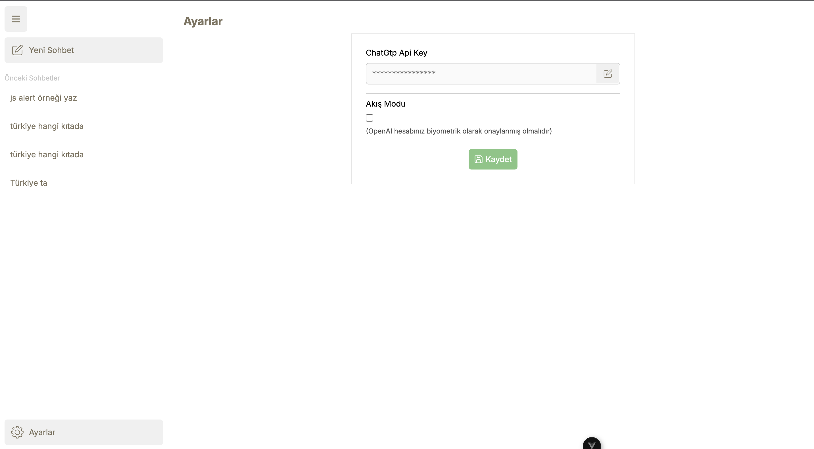

# Simple Chat Uygulaması

## Genel Bakış
Simple Chat, Vue 3 ve Vite tabanlı, modern ve kullanıcı dostu bir ChatGPT 5 api tabanlı sohbet uygulamasıdır. Mobil ve web platformlarında çalışacak şekilde Capacitor ile uyumlu geliştirilmiştir. Dexie.js ile yerel veritabanı yönetimi, modern arayüz bileşenleri ile pratik bir kullanıcı deneyimi hedeflenmiştir.

## Temel Özellikler
- **Vue 3 ile geliştirilmiş SPA mimarisi**
- **OpenAI API ile sohbet** (kullanıcıdan alınan API anahtarı ile)
- **Dexie.js ile IndexedDB tabanlı yerel veri saklama**
- **Capacitor ile mobil uyumluluk**
- **Markdown desteği ve zengin mesaj formatlama**
- **Capacitor Secure Storage ile güvenli api key saklama**
- **Akış (stream) ve klasik yanıt modları**
- **Tüm konuşmalarda harcanan token'ı görebilme**

## Kurulum ve Çalıştırma
### Gereksinimler
- Node.js 20.19.0 veya üzeri
- npm

### Kurulum
```bash
npm install
```

### Geliştirme Ortamı
```bash
npm run dev
```

### Üretim Derlemesi (Mobile aktarım öncesi gereklidir)
```bash
npm run build
```

### Capacitor İle Mobil Platformların Eklenmesi
```bash
npx cap add android
npx cap add ios
```

### Oluşturulan Kodun Capacitor İle Mobil Platformlara Entegrasyonu
```bash
npx cap sync
```

### Oluşturulan Android Kodunun Android Studio İle Açılması
```bash
npx cap open android
```

### Oluşturulan Android Kodunun Emulatör veya Cihazda Çalıştırılması
```bash
npx cap run android
```

### Oluşturulan IOS Kodunun XCode İle Açılması
```bash
npx cap open ios
```

### Oluşturulan IOS Kodunun Emulatör veya Cihazda Çalıştırılması
```bash
npx cap run ios
```

## Proje Yapısı
```
├── src/
│   ├── App.vue                # Ana uygulama bileşeni
│   ├── main.js                # Giriş noktası, router ve stiller
│   ├── assets/                # Statik dosyalar ve stiller
│   ├── components/            # Mesaj listesi ve prompt gibi temel bileşenler
│   ├── composables/           # OpenAI ve veritabanı yönetimi
│   ├── router/                # Vue Router yapılandırması
│   └── views/                 # Sayfa bileşenleri (Sohbet, Yeni Sohbet, Ayarlar)
├── public/                    # Statik dosyalar
├── package.json               # Bağımlılıklar ve scriptler
├── vite.config.js             # Vite yapılandırması
├── capacitor.config.json      # Capacitor yapılandırması
└── README.md                  # Proje dokümantasyonu
```

## Ana Bileşenler ve Fonksiyonlar
- **App.vue**: Uygulamanın ana iskeleti, menü ve sayfa yönlendirmeleri.
- **MessageList.vue**: Mesajların listelenmesi ve detaylarının gösterimi.
- **Prompt.vue**: Kullanıcıdan giriş alınan ve model/akış seçilebilen alan.
- **Chat.vue & NewChat.vue**: Sohbet ekranları, OpenAI API ile etkileşim ve mesaj yönetimi.
- **Settings.vue**: API anahtarı ve akış modu gibi ayarların yönetimi.
- **database.js**: Dexie.js ile sohbet ve mesajların yerel olarak saklanması.
- **useOpenAi.js**: OpenAI istemcisinin başlatılması ve yönetimi.

## Güvenlik ve Gizlilik
- API anahtarı, Capacitor Secure Storage ile güvenli şekilde saklanır.
- Kullanıcı verileri yalnızca yerel olarak tutulur.
- * OpenAI sunucu bağlantısı kurulumu client tarafta olduğu için konsolda uyarı mesajı görüntülemektedir. Server side rendering ile çözülebilir.

## Mobil ve Web Uyumluluğu
- Uygulama, Capacitor ile Android/iOS platformlarına kolayca aktarılabilir.
- Responsive tasarım ile mobil ve masaüstü cihazlarda çalışır.

## Ekran Görüntüleri
<div style="display: flex; flex-wrap: nowrap; overflow: auto; width:100%;">


</div>

## Lisans
İstenilen şekilde kullanılabilir ve dağıtılabilir.
